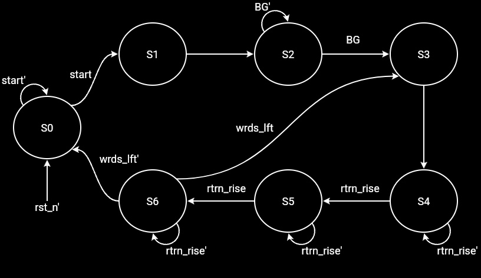

<!---

This file is used to generate your project datasheet. Please fill in the information below and delete any unused
sections.

You can also include images in this folder and reference them in the markdown. Each image must be less than
512 kb in size, and the combined size of all images must be less than 1 MB.
-->

# AUTh DMA Controller Documentation

## Contents

- [Overview](#overview)
- [I/O Configuration](#io-configuration)
- [State Diagram](#state-diagram)
- [How to test](#how-to-test)

## Overview

The core function of the DMA Controller (DMAC) is to take over the system buses and transfer data from memory to an I/O device, or vice versa, when instructed by the CPU. In this implementation, the DMAC is synchronous with the CPU, while memory operates in a second clock domain and the I/O device operates in a third clock domain.

Both word and address width are 8 bits. The DMAC supports two operating modes:

- Single-word transfer mode
- Four-word burst mode

In burst mode, both source and destination addresses are incremented by 1 after each transfer. The DMAC is implemented as a finite state machine (FSM).

## I/O Configuration

Since this project is submitted to a Tiny Tapeout shuttle, there is a strict pin budget: 8 input pins, 8 output pins, 8 bidirectional pins, and 2 pins for clock and reset.

The I/O pins are configured as follows.

### Inputs

- `ui[7]`: `start` - Sent by the CPU to indicate that transfer instructions are about to be provided.
- `ui[6]`: `BG` - Sent by the CPU to indicate that the DMAC is granted control of the system bus.
- `ui[5]`: `rtrn` - Sent by either memory or the I/O device to indicate either: (i) data sent by the DMAC has been received, or (ii) data loaded onto the transfer bus is ready to be read.
- `ui[4:0]`: `cfg_in[4:0]` - Configuration input from the CPU over 4 cycles, carrying mode, direction, source address, and destination address.

### Outputs

- `uo[7]`: `BR` - Sent to the CPU to request control of the system bus.
- `uo[6]`: `WRITE_en` - Sent to memory or the I/O device to indicate whether data should be written or read.
- `uo[5]`: `done` - Sent to the CPU when all transfers are complete.
- `uo[4]`: `valid` - Sent to memory or the I/O device to indicate that address/data on the transfer bus is valid.
- `uo[3]`: `ack` - Sent to memory or the I/O device to indicate that the DMAC has received incoming data.
- `uo[2]`: `target` - Indicates whether transfer bus address/data is intended for memory or the I/O device.
- `uo[1:0]`: Unused.

### Bidirectional

- `uio[7:0]`: `transfer_bus[7:0]`

## State Diagram

### States

- `S0: IDLE` - Idle state before `start` is asserted.
- `S1: PREPARATION` - Loading CPU instructions.
- `S2: WAIT4BG` - Waiting for the CPU to grant control over the system bus.
- `S3: SRC_SEND` - Sending address to source.
- `S4: RECEIVE` - Receiving data from source.
- `S5: SENDaddr` - Sending address to destination.
- `S6: SENDdata` - Sending data to destination.

Notes:

- In the state diagram above, `rtrn_rise` is an internal pulse generated when `rtrn` rises to high.
- `wrds_lft` is not an actual signal; it indicates whether there are still words left to transfer in four-word burst mode.

## How to test
