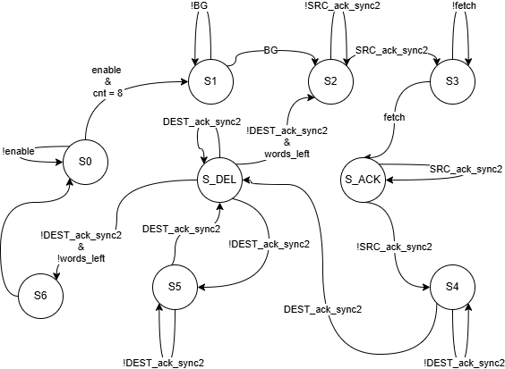

<!---

This file is used to generate your project datasheet. Please fill in the information below and delete any unused
sections.

You can also include images in this folder and reference them in the markdown. Each image must be less than
512 kb in size, and the combined size of all images must be less than 1 MB.
-->

# AUTh DMA Controller Documentation

## Contents

- Overview
- I/O Configuration
- State Diagram
- How to test

## Overview

The core function of the DMA Controller (DMAC) is to take over the system buses and transfer data from memory to an I/O device, or vice versa, when instructed by the CPU. In this implementation, the DMAC is synchronous with the CPU, while memory operates in a second clock domain and the I/O device operates in a third clock domain.

Both word and address width are 8 bits. The DMAC supports two operating modes:

- Single-word transfer mode
- Four-word burst mode

In burst mode, both source and destination addresses are incremented by 1 after each transfer. The DMAC is implemented as a finite state machine (FSM).

In the `/src` folder apart from the top module, there are two additional modules **(memory.v and io.v)** that help in the testing of the design. Specifically these two modules simulate the behaviour of the memory and the io device, giving us the opportunity to test accurately our DMAC. The DMAC is implemented in the `project.v` file.

## I/O Configuration

Since this project is submitted to a Tiny Tapeout shuttle, there is a strict pin budget: 8 input pins, 8 output pins, 8 bidirectional pins, and 2 pins for clock and reset.

The I/O pins are configured as follows.

### Inputs

The required configuration data in order the DMA to start doing work, are the following: 

- 1 bit for the enable
- 1 bit for the BG
- 1 bit for the mode
- 1 bit for the direction 
- 8 bits for the source address
- 8 bits for the destination address

In order to get all the required configuration data

- `ui[7]` --> `enable`: Sent by the **CPU** to indicate that the DMA will receive now and for the next **7** clock cycles configuration data. We assume that the **enable** should stay high during the whole procedure.
- `ui[6]` --> `BG`: Sent by the **CPU** to indicate that the DMAC now has control of the system bus. It is sent after a bus request from the DMA **(BR)**.
- `ui[5]` --> `fetch`: Sent by the **source** device to indicate that data are now safe and ready to receive.
- `ui[4]` --> `mode_dir`: Sent by the **CPU**. It indicates the mode **(single or burst)** and the direction **(which device sends data and which receives them)**. Because the same bit is used for two different purposes, we have made the following assumption: The mode bit will be sent in the first 8 bit message the CPU will send and the direction bit will be sent in the second 8 bit message. For the rest of the messsages the CPU will send to the DMA thsi bit has no meaning.
- `ui[3:2]` --> `bit_2_address_sent[1:0]`: CPU sends the source and destination addresses in batches of two bits. Since our DMA controller is 8 bit, we need 8 clock cycles to send the full addresses **(16 bits in total)**.
- `ui[1]` --> `IO_ack`: Sent bu the IO device to indicate that data was successfuly received. 
- `ui[0]` --> `MEM_ack`: Sent bu the memory to indicate that data was successfuly received. 

### Outputs

- `uo[6]` --> `BR`: Sent to the CPU to request control of the system bus.
- `uo[5]` --> `mode`: Sent to the source and destination devices.
- `uo[4]` --> `ack`: After receiving data the DMA sends an acknowledgment bit, indicating successful data reception. 
- `uo[3]` --> `bus_dir`: Sent to the source and destination devices to inform them about the roles - who is the source and who is the destination device.
- `uo[2]` --> `done`: Indicates successful or unsuccessful end to the DMA operations.
- `uo[1]` --> `WRITE_en`: Indicates if the DMA wants to write or read data.
- `uo[0]` --> `valid`: Sent to the memory and the io device indicating that data are safe and ready to read.

### Bidirectional

- `uio` --> `transfer_bus`: Data exchange between the DMA, the memory and the io takes place with this 8 bit register.

## How it works

As mentioned before, our DMA Controller is structured as an FSM. In order to explain how it works, we will present each state individually. To further assist the reader's understanding, there is also a state diagram below the following list.

- `S0: IDLE_PREPARATION`: The DMA remains in this state until we have received `enable = 1` and 8 clock cycles have passed.
- `S1: BUS_REQ`: The DMA requests the control of the data bus and remains in the same state until the CPU responds with `BG = 1`.
- `S2: DMA_to_SRC`: DMA sends to the source device the address that contains the required data. As we previously mentioned, source device can be the memory or the IO device depending on the direction. Together with the data, DMA sends a `valid` 1 bit signal as well, indicating to the source device that data is ready. The `valid` signal is being synchronised when receives from the source. All this procedure ensures that there will be no data corruption due to metastability. In order to leave this state we need to receive an acknowledgment bit from the source device.
- `S3: SRC_to_DMA`: DMA receives the data from the source's target address and moves to the next state when it receives a `fetch` signal that serves the same purpose with the DMA's valid signal, it ensures that data in the bus are ready to receive.
- `S_ACK: ACKNOWLEDGMENT`: After receiving data, the DMA sends an acknowledgment bit to inform the sender that data was successfuly received. The condition to move on from this state is the following: `!fetch_sync2`. If we get a low synchronized signal we can assume that the sender received the acknowledgment and moved to it's next state.
- `S4: DMA_to_DEST_addr`: Following the same logic with the `DMA_to_SRC` state, we send the destination address and wait for acknowledgment.
- `S5: DMA_to_DEST_data`: Following the same logic with the `DMA_to_SRC` state, we send the destination data and wait for acknowledgment.
- `S_DEL: DELAY`: This state is needed because we have two consecutive data shipments: First the state `DMA_to_DEST_addr` and immediately after `DMA_to_DEST_data`. Both of these states need to send the `valid` signal and if they happen consecutively then the `valid` will never go low. This causes the destination device to get stuck in it's acknowledgment state, because it never detects a **0** bit in the valid signal, which wrongly means that the DMA never received the acknowledgment bit. 
To overcome this problem we created this state which makes the `valid` signal low and moves to the `DMA_to_DEST_data` state when the received acknpwledgment bit goes low as well, which means that the destination device didn't get stuck.
- `S6: DONE`: After the procedure has finishes sand all the data are sent, the DMA raises the done bit for **1** clock cycle and then returns to the `IDLE_PREPARATION` state.

## How to test

Using cocotb python testbench and Icarus Verilog simulator.

## External hardware

List external hardware used in your project (e.g. PMOD, LED display, etc), if any
